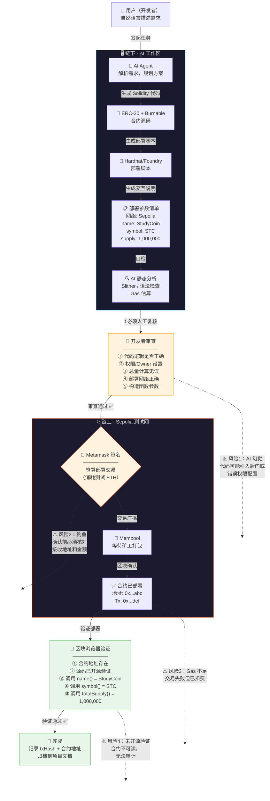

# AI × Web3 最小工作流：从"AI 说"到"链上做"

> 日期：2026-05-27
> 来源：AI × Web3 School · Week 2

---

## 一、场景：AI 辅助部署一个 ERC-20 Token 到测试网

一个开发者想部署一个带燃烧机制（burnable）的 ERC-20 Token 到 Sepolia 测试网。她用自然语言告诉 AI："帮我写一个 ERC-20，名字叫 StudyCoin，符号 STC，总量 100 万，可燃烧，部署到 Sepolia。"

---

## 二、流程图



---

## 三、流程解读（文字版）

| 步骤 | 谁发起 | 谁执行 | 钱包签名？ | 必须人工？ | 如何验证 |
|------|--------|--------|-----------|-----------|----------|
| ① 需求描述 | 👤 用户 | — | — | — | — |
| ② 方案规划 | 👤 用户 | 🤖 AI | — | — | AI 输出方案供审查 |
| ③ 代码生成 | 🤖 AI | 🤖 AI | — | — | 静态分析 + 编译 |
| ④ 代码审查 | 🤖 AI 提示 | 👤 用户 | — | 🔴 必须 | 逐行阅读合约代码 |
| ⑤ 部署签名 | 👤 用户 | 👤 用户 | 🔐 是 | 🔴 必须 | 钱包 UI 核对参数 |
| ⑥ 链上部署 | 👤 用户签名 | ⛓️ 网络 | 🔐 已签 | — | 等待区块确认 |
| ⑦ 区块验证 | 👤 用户 | 🔎 Explorer | — | 🟡 建议 | 读链上状态 |
| ⑧ 源码开源 | 👤 用户 | 👤 用户 | 🔐 是 | 🔴 必须 | Explorer 上查看源码 |

---

## 四、AI / 人 / 链 三者边界

```
┌──────────────────────┐
│     🤖 AI 的边界      │
│                      │
│  • 生成代码           │
│  • 生成脚本           │
│  • 静态分析           │
│  • Gas 估算           │
│  • 参数检查           │
│                      │
│   ❌ 不能碰的：       │
│  • 私钥 / 签名        │
│  • 最终部署决定        │
│  • 资金转移批准        │
└────────┬─────────────┘
         │
    ┌────▼────┐
    │  交接线  │  ← 代码 + 部署参数
    └────┬────┘
         │
┌────────▼─────────────┐
│     👤 人的边界       │
│                      │
│  • 审查代码逻辑        │
│  • 确认部署参数        │
│  • 签署交易            │
│  • 验证链上结果        │
│                      │
│   🔴 全部必须人工      │
└────────┬─────────────┘
         │
    ┌────▼────┐
    │  签名线  │  ← 私钥签名（唯一安全边界）
    └────┬────┘
         │
┌────────▼─────────────┐
│    ⛓️ 链的边界        │
│                      │
│  • 执行合约代码        │
│  • 保证不可篡改        │
│  • 提供公开验证        │
│  • Gas 计费           │
└──────────────────────┘
```

> **核心原则**：AI 负责「产出」，人负责「决定」，链负责「执行」。三者之间被「代码审查」和「私钥签名」两道硬边界隔开——这两道边界永远不能由 AI 跨越。

---

## 五、风险地图

| # | 风险 | 发生位置 | 严重度 | 缓解措施 |
|---|------|----------|--------|----------|
| 1 | **AI 幻觉引入漏洞** | AI 生成代码阶段 | 🔴 高 | 开发者逐行审查 + Slither 静态分析 |
| 2 | **钓鱼 / 错误地址** | 钱包签名阶段 | 🔴 高 | 签名前逐字核对地址、链 ID、金额 |
| 3 | **Gas 不足 / 参数错误** | 链上执行阶段 | 🟡 中 | 先在测试网跑，确认后再主网 |
| 4 | **源码未开源** | 验证阶段 | 🟡 中 | 部署后立即 `verify-contract` |
| 5 | **AI 权限错误** | 代码审查阶段 | 🔴 高 | 特别注意 `onlyOwner` 函数和 `mint` 权限 |
| 6 | **测试网 ≠ 主网** | 跨环境迁移 | 🟡 中 | 主网部署前在每个环境独立复核 |

---

## 六、五句话总结

1. **解决什么问题**：让开发者用自然语言驱动合约开发和部署，AI 负责代码产出与检查，但安全的最终责任由人承担。

2. **AI 辅助哪些步骤**：AI 负责需求解析、Solidity 代码生成、部署脚本生成、静态安全分析（Slither）、Gas 估算——这些全部在链下完成，不接触私钥。

3. **哪些步骤必须人工**：**代码审查**（验证 AI 没有引入漏洞或后门）和**签署部署交易**（私钥是人控制链上操作的唯一安全边界）——这两步任何情况下都不能由 AI 代理。

4. **如何验证结果**：部署后在区块浏览器上验证三点：合约地址存在且字节码匹配、源码已开源验证（verified）、调用 `name()` / `symbol()` / `totalSupply()` 确认链上状态与预期一致。

5. **主要风险**：AI 可能「自信地犯错」——生成看似正确但有安全漏洞的合约代码，且开发者若因信任 AI 而跳过代码审查，就是最大的风险点。**永远不要让 AI 直接签名交易。**
