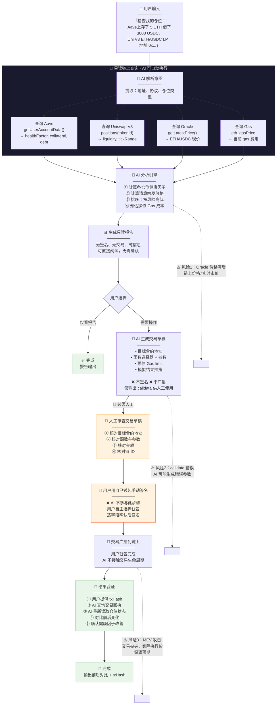

# 受限 Web3 助手设计：DeFi 仓位健康检查助手

> 日期：2026-05-27
> 来源：AI × Web3 School · Week 2
>
> 设计原则：AI 可以**读链、算数、写草稿**；AI 不能**碰私钥、签名、转账**。

---

## 一、这个助手解决什么问题

DeFi 用户通常同时在多个协议（Aave、Compound、Uniswap V3 LP）持有仓位。市场波动时，用户需要快速了解：

- 各仓位的健康因子是否接近清算线
- 哪个仓位需要优先补充保证金
- 如果操作，需要调用哪个合约函数、传什么参数

手动做这件事需要打开多个 DApp、逐个查询、心算健康因子——耗时且容易漏。「仓位健康检查助手」自动完成数据采集和分析，生成一份**只读的健康报告 + 可选的操作草稿**，但所有需要签名的操作都由用户手动完成。

---

## 二、安全边界（核心约束）

```
┌─────────────────────────────────────────────────────┐
│                  AI 可以做的事                        │
│                                                     │
│  ✅ 读取链上数据（只读 RPC 调用）                      │
│  ✅ 计算健康因子 / 清算价格                           │
│  ✅ 查询 Gas 费用                                    │
│  ✅ 生成交易草稿（to, data, value）                   │
│  ✅ 解析交易模拟结果                                  │
│  ✅ 检查合约是否已验证                                │
│  ✅ 格式化输出                                       │
└─────────────────────────────────────────────────────┘

┌─────────────────────────────────────────────────────┐
│                AI 绝不能做的事                        │
│                                                     │
│  ❌ 接触私钥 / 助记词 / API Key                       │
│  ❌ 签署任何交易                                      │
│  ❌ 调用 approve / transfer / 任何写操作               │
│  ❌ 代表用户广播交易                                  │
│  ❌ 存储或缓存任何凭证                                │
└─────────────────────────────────────────────────────┘
```

---

## 三、完整工作流



---

## 四、输入输出示例

### 用户输入

```
检查我的仓位健康状态：
- 地址：0x742d35Cc6634C0532925a3b844Bc9e7595f0bEb1
- 协议：Aave V3（Ethereum 主网），存了 5 ETH 作为抵押，借了 3000 USDC
- 协议：Uniswap V3，ETH/USDC 0.3% LP，tokenId 假设为 12345

如果任何仓位健康因子 < 1.5，建议我该怎么补仓。
```

### AI 输出示例（只读报告）

```markdown
## 📊 DeFi 仓位健康报告

**地址**：0x742d...bEb1  
**网络**：Ethereum 主网（chainId: 1）  
**查询时间**：2026-05-27 14:30 UTC  
**ETH 价格**：$3,200（Chainlink Oracle）

---

### 仓位 1：Aave V3 借贷

| 指标 | 数值 | 状态 |
|------|------|------|
| 抵押品 | 5 ETH（$16,000） | ✅ |
| 借款 | 3,000 USDC | — |
| 健康因子 | **1.67** | 🟡 偏低 |
| 清算价格 | ETH ≤ $720 | ⚠️ 距现价 -77.5% |
| 最大 LTV | 80%（已用 18.75%） | ✅ 安全 |

> 🟡 当前安全，但如果 ETH 跌至 $1,200 以下（距现价 -62.5%），健康因子将降至 1.0 以下触发清算。

---

### 仓位 2：Uniswap V3 LP

| 指标 | 数值 | 状态 |
|------|------|------|
| 价格区间 | $2,800 – $3,600 | ✅ 在区间内 |
| 当前 tick | 处于活跃区间 | ✅ 赚取费用 |
| 无常损失估算 | ~1.2% | ✅ 轻微 |

---

### 🚨 风险排序

1. **Aave 仓位** 🟡 需关注（健康因子 1.67 < 推荐值 2.0）
2. Uni V3 仓位 ✅ 健康

---

### 💡 建议操作（仅建议，需人工决策）

- **补充抵押品**：追加 2 ETH 可将健康因子提升至 3.73
- **偿还部分借款**：偿还 1,500 USDC 可将健康因子提升至 3.33

> ⚠️ 以上仅为信息建议，不构成操作指令。实际操作请自行判断。
```

### 如果用户选择「生成操作草稿」

```markdown
## 📝 操作草稿：Aave V3 补充抵押品

> ❌ 此草稿仅用于参考。AI 不签名、不广播。
> 请在钱包中**手动逐字段核对后签名**。

| 字段 | 值 |
|------|-----|
| 目标合约 | `0x87870Bca3F3fD6335C3F4ce8392D69350B4fA4E2`（Aave V3 Pool） |
| 函数 | `supply(address asset, uint256 amount, address onBehalfOf, uint16 referralCode)` |
| 参数 | asset=`0xC02aaA39b223FE8D0A0e5C4F27eAD9083C756Cc2`（WETH） |
|  | amount=`2000000000000000000`（2 ETH，18 位精度） |
|  | onBehalfOf=`0x742d...bEb1`（你的地址） |
|  | referralCode=`0` |
| 预估 Gas | ~150,000 gas（约 0.003 ETH @ 20 gwei） |
| 链 ID | 1（Ethereum 主网） |

**操作步骤**：
1. 🔴 核对目标合约地址 = Aave V3 Pool 官方地址
2. 🔴 核对 amount = 2 ETH 正确
3. 🔴 在自己钱包中手动发起交易，逐字段确认
4. 🔴 确认后再签名广播
```

---

## 五、人工确认点汇总

| # | 步骤 | 必须人工？ | 理由 |
|---|------|-----------|------|
| 1 | 读取链上数据 | 🟢 AI 自动 | 只读操作，无风险 |
| 2 | 计算健康因子 | 🟢 AI 自动 | 纯数学，结果可复算 |
| 3 | 生成只读报告 | 🟢 AI 自动 | 信息聚合，无链上副作用 |
| 4 | 生成操作建议 | 🟢 AI 自动 | 仅建议，不执行 |
| 5 | **审查交易草稿** | 🔴 必须人工 | 核对地址、函数、参数 |
| 6 | **钱包签名** | 🔴 必须人工 | AI 不接触私钥 |
| 7 | **广播交易** | 🔴 必须人工 | 用户钱包完成 |
| 8 | 查询交易回执 | 🟢 AI 自动 | 只读，确认执行结果 |
| 9 | 验证仓位变化 | 🟢 AI 自动 | 只读对比前后状态 |

---

## 六、风险与限制（≥3）

### 风险 1：Oracle 价格 ≠ 真实成交价 🟡

| 项 | 说明 |
|----|------|
| **问题** | AI 通过 Chainlink Oracle 读取 ETH 价格（如 $3,200），但市场暴跌时 Oracle 更新可能有延迟（心跳间隔 1h），实际市场价可能已跌至 $2,800。用户看到「健康因子 1.67」时，实际可能已触发清算。 |
| **缓解** | 报告中注明数据来源和时间戳；建议用户同时查看多个价格源（CEX 现货价）。 |

### 风险 2：交易草稿中的 calldata 可能有误 🔴

| 项 | 说明 |
|----|------|
| **问题** | AI 生成的 calldata 可能包含错误的函数选择器、参数编码错误、或指向了错误的合约地址。如果用户不审查直接签名，资金可能丢失。 |
| **缓解** | 草稿输出中**显式标注每个参数的明文含义**（如 `asset=WETH 地址` 而非裸哈希），降低审查门槛；用户应对照 Etherscan 验证合约。 |

### 风险 3：MEV 攻击导致执行价偏离 🟡

| 项 | 说明 |
|----|------|
| **问题** | 用户按 AI 建议签名后，交易可能被 MEV 机器人三明治攻击，实际执行价格偏离预期。AI 估算的 Gas 和滑点可能与实际情况不符。 |
| **缓解** | 在操作建议中提示用户设置合理的滑点/优先级费；对于大额交易，建议使用 Flashbots 私有交易通道。 |

### 限制 4：跨协议复杂性 🟡

| 项 | 说明 |
|----|------|
| **问题** | 如果用户仓位跨越 5+ 个协议且相互关联（如用 Aave 的 aToken 做 Curve LP 再质押到 Convex），AI 需要递归解析多层合约——每一次 RPC 调用都可能超时或返回不完整数据，导致分析不准确。 |
| **缓解** | 限制单次查询的协议数量（如最多 3 个）；对复杂嵌套仓位提示用户分步查询。 |

---

## 七、如何验证结果

| 验证维度 | 方法 | 工具 |
|----------|------|------|
| **链上数据准确性** | 对照 Etherscan 上同一地址的读操作结果 | Etherscan「Read Contract」 |
| **健康因子计算** | 手动用公式复算：`healthFactor = (collateral × price × liquidationThreshold) / debt` | 计算器 / 链上合约直接读 |
| **合约地址正确性** | 核对 Etherscan 上已验证的合约标签（如 Aave V3 Pool 已标记） | Etherscan |
| **交易执行结果** | 查询 txHash → 检查事件日志（如 Aave 的 `Supply` 事件） | Etherscan「Logs」tab |
| **仓位变化** | 操作后重新运行 AI 查询，对比前后数值 | 同一助手重新查询 |

---

## 八、核心设计原则

```
┌──────────────────────────────────────────────────────┐
│                                                      │
│   AI 的边界 =「信息」                                  │
│   • 读数据 → 分析 → 建议 → 生成草稿                    │
│                                                      │
│   人的边界 =「决定」                                    │
│   • 审查 → 判断 → 签名 → 广播                          │
│                                                      │
│   链的边界 =「执行」                                    │
│   • 验证签名 → 执行合约 → 状态变更                      │
│                                                      │
│   ⚠️  信息 可以流入 AI                                │
│   ⚠️  决定 必须由人做出                               │
│   ⚠️  执行 由链保证不可逆                              │
│                                                      │
└──────────────────────────────────────────────────────┘
```
